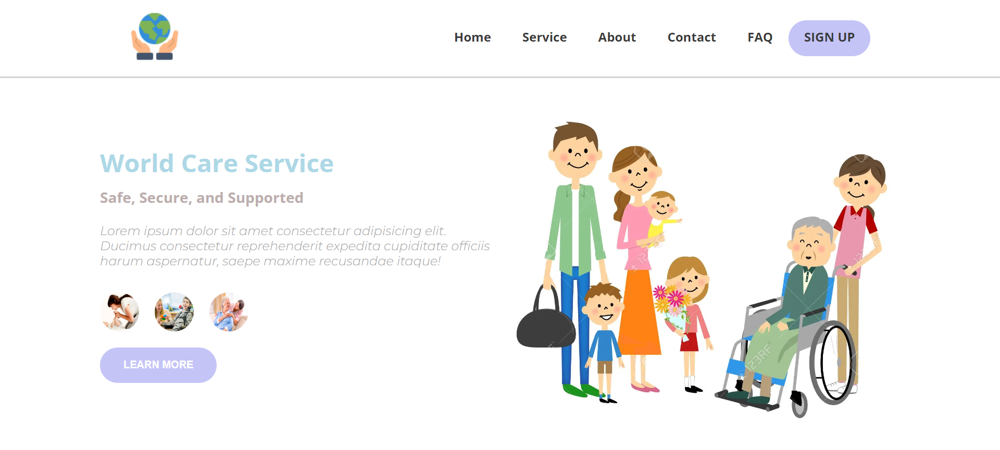

### Word Care Service Hero Section using html css js

##### Pure JavaScript utility for desktop browsers for image zoom on mouse hover. No external dependencies required.
- https://github.com/malaman/js-image-zoom

### Web Version

  

- Features: 
- click the three round image above the Learn More button. The right side image will change.
- Hover the image, it's magnifying.
- not suitable for mobile version.